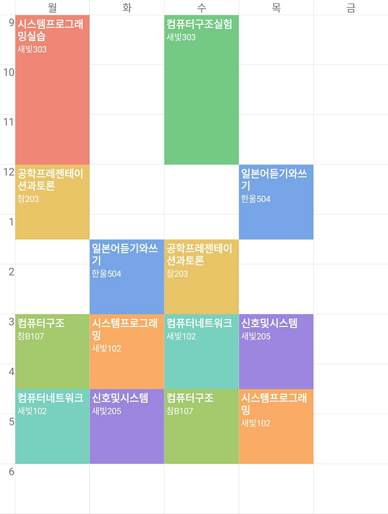
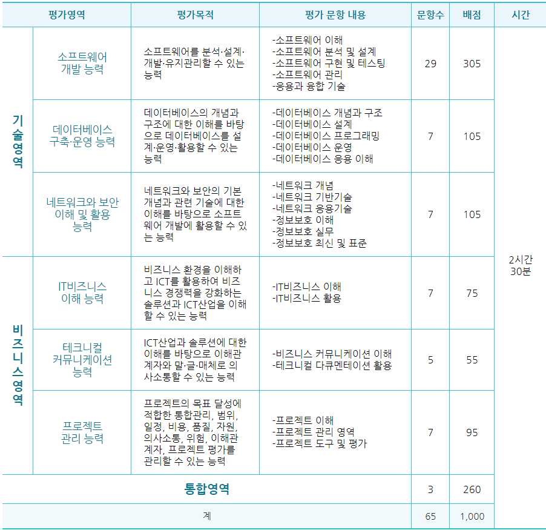
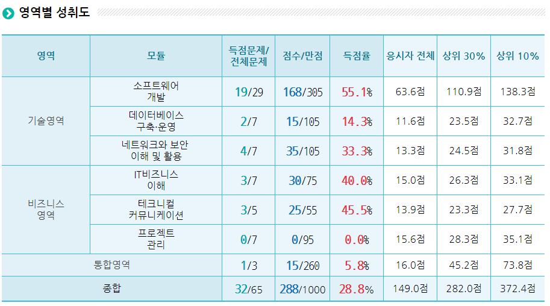

내 시간표는 위와 같다. 
> **월화수목**
12 ~ 2시 사이에는 점심을 먹는다.
6시에 끝나면 저녁을 먹는다. 

> **목**
수업이 끝나는 날.
이 날은 저녁 먹는 대신 바로 집으로.
집에 도착하면 9시쯤.

> **금토일**
월화수목 동안 못했던걸 한다.
다 했다면 우선순위가 높은것부터 미리 예습.
(앞일은 어떻게 될지 모르는 거니까)

> **일**
저녁쯤에 기숙사로 간다.
아마 1시까진 시간이 날것 같다.
하지만 유동적이니 이 날은 하고 싶은 걸 한다.(공부해도 OK)

그러면 내가 쓸 수 있는 시간은

  - 월 : 오전 7시 ~ 오전 8시     , 오후 7시 ~ 오전 1시   -> 7시간
  - 화 : 오전 7시 ~ 오후 12시 반 , 오후 7시 ~ 오전 1시   -> 11시 30분간
  - 수 : 오전 7시 ~ 오전 8시     , 오후 7시 ~ 오전 1시   -> 7시간
  - 목 : 오전 7시 ~ 오전 11시    , 오후 10시 ~ 오전 1시  -> 7시간
  - 금 : 오전 7시 ~ 오후 12시    , 오후 1시 ~ 오전 1시   -> 17시간
  - 토 : 오전 7시 ~ 오후 12시    , 오후 1시 ~ 오전 1시   -> 17시간
  - 일 : 오전 7시 ~ 오후 X시     , 오후 Y시 ~ 오전 1시   -> ?(유동적)

일주일에 총 쓸수 있는 시간은 **66시 30분** + α. 

그럼 이제 내가 해야할 것들의 일정을 알아보자.

# TOPCIT
|        평가명        |       접수기간      |         평가일시        |
|:--------------------:|:-------------------:|:-----------------------:|
| 제9회 정기평가(국문) | 18.04.09 ~ 18.04.20 | 18.05.19  09:30 ~ 12:00 |
| 제9회 정기평가(영문) | 18.04.09 ~ 18.04.20 | 18.05.19  09:30 ~ 12:00 |

2018\. 3. 7. 오전 11:56:13 현재 시간 기준으로 시험까지 **2개월 12일** 남았다. 물론 중간중간 여러 일이 있을테니 이 시간마저 온전히 다 쓰기란 어려울 것이다. 따라서 평가체계에 따라 우선순위를 정해보자.

역시 소프트웨어 개발 능력을 제일 많이 본다. 여기선 크게 생각하지 말고 내가 약한 부분부터 공략한다.

